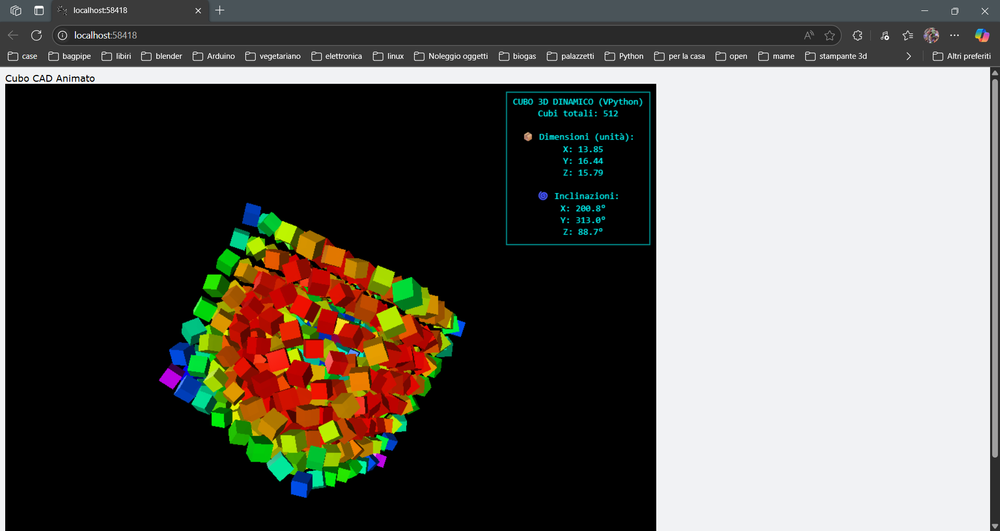

# 🌀 Dynamic 3D Cube – VPython Art Simulation



**Dynamic 3D Cube** is a real-time animated visual experience written in Python using VPython: a main cube made of smaller rotating units that pulse, spin, and glow in rainbow harmony. All of this is complemented by a **technical animated HUD** displaying angles, dimensions, and cube count – like a mini CAD system.

---

## 🎨 Features

* ✅ Main cube composed of independently animated mini-cubes
* 🌈 Dynamic colors and rhythmic pulsing
* 🎯 Smooth 3D rotations around the central axis
* 📀 Technical HUD showing angles (in degrees) and live dimensions
* 💡 "Simultaneous rainbow" effect for visual impact

---

## 📦 Requirements

* Python 3.7 or higher
* [VPython](https://pypi.org/project/vpython/)

Install dependencies with:

```bash
pip install vpython
```

---

## 🚀 Getting Started

Run the script directly:

```bash
python cubo_art.py
```

To force **"no browser"** mode, edit the script like this:

```python
import os
os.environ['WEBVPYTHON'] = 'nobrowser'
```

---

## 🖼️ Preview


All cubes in this simulation are trained professionals. Any distortion, rotation, or color explosion was performed in a controlled environment. No cubes were harmed during the animation. 🎬

---

## 📄 License

This project is released under the **MIT License**.

You are free to:

* Use it for any purpose
* Study and modify it
* Share and integrate it into other (even commercial) projects

---

## 🤝 Acknowledgments

* Inspired by the artistic work of **Alexandre B A Villares**
* Crafted with nerdy love by Pietro, between Python sessions, WEEE hacking, 3D printing, and playing with my son.

---

> 🧠 "Mathematics meets light: every cube dances, every color breathes. Computational art, with heart."
> — *Anonymous*


